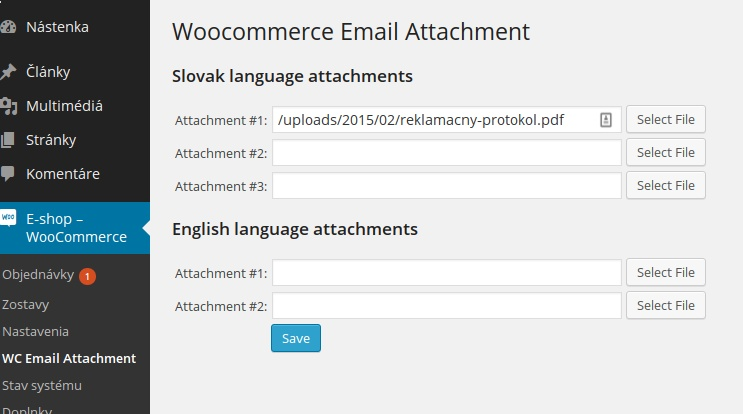

=== Woocommerce Email Attachment ===
Contributors: michalzuber
Tags: woocommerce, email, attachment
Requires at least: 3.5.1
Tested up to: 3.9
Stable tag: 1.0.0
License: GPLv2 or later
License URI: http://www.gnu.org/licenses/gpl-2.0.html

Adds 2 attachments to processing email.

== Description ==

Due law change http://blog.riesenia.com/fotak-na-dovolenku-zadarmo-alebo-nove-pravidla-pre-e-shopy/ it
is needed to send 2 forms with the order (http://www.nakupujbezpecne.sk/docs/form/odstupenie%20od%20zmluvy.pdf, http://www.nakupujbezpecne.sk/docs/form/reklamacia.pdf).
Law info available at http://nakupujbezpecne.sk/docs/zakony/102_2014.pdf

