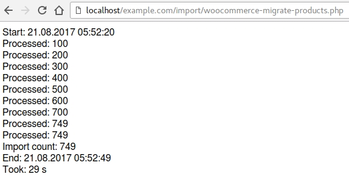

# Migrate WooCommerce products to another Woocommerce via API

**This is not a plugin**. Place it for example in `import/` dir.

You gonna need API access tokens from *WooCommerce* -> *Settings* -> *API*

More info about WooCommerce API at
[https://docs.woocommerce.com/document/woocommerce-rest-api/](https://docs.woocommerce.com/document/woocommerce-rest-api/)

## Example script output

